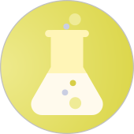

### Project Classification

### Code Repository
* [GitHub Repository](https://github.com/OWASP/Amass)

### Downloads or Social Links
* [Official Binary Images](https://github.com/OWASP/Amass/releases)
* [Official Docker Images](https://hub.docker.com/r/caffix/amass)
* [Official Twitter Account](https://twitter.com/owaspamass)
* [Join the Amass Discord Server](https://discord.gg/rtN8GMd)

### Getting Involved

- [Contributing to Amass](https://github.com/OWASP/Amass/blob/master/CONTRIBUTING.md)

### Licensing

The OWASP Amass Project is free to use under the [Apache 2.0 License](https://www.apache.org/licenses/LICENSE-2.0).
